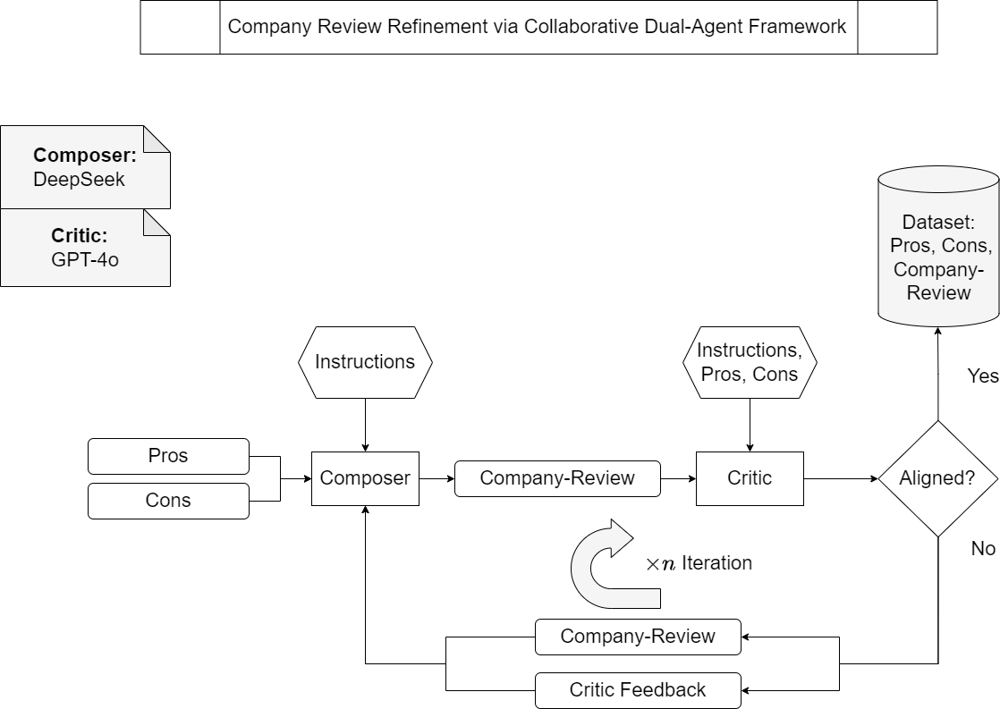
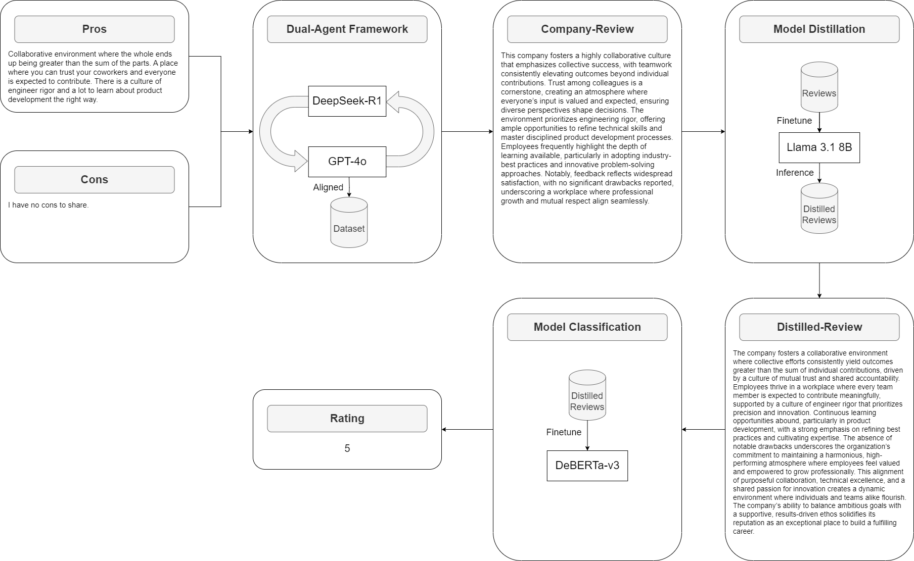

## Review Companies Using Employee Sentiments
The proposed framework orchestrates a dialogue between two distinct yet harmonized agents.  DeepSeek-R1, as the Composer, crafts insightful reviews, while GPT-4o, serves and acts as a discerning critic to achieve nuanced company reviews derived from employee feedback through an iterative, dynamic discours.

#### Architectural Overview:
We utilize a dual-agent AI framework featuring two distinct models LLMs:

- Composer Agent:
  - DeepSeek-R1
- Critic Agent:
  - GPT-4o

#### The End-to-End Pipeline
The architecture depicts the end-to-end pipeline: 
- Dual-Agent Framework 
- Model Distillation 
  - LLaMA 3.1 8B
- Model Classification
  - DeBERTa-V3

